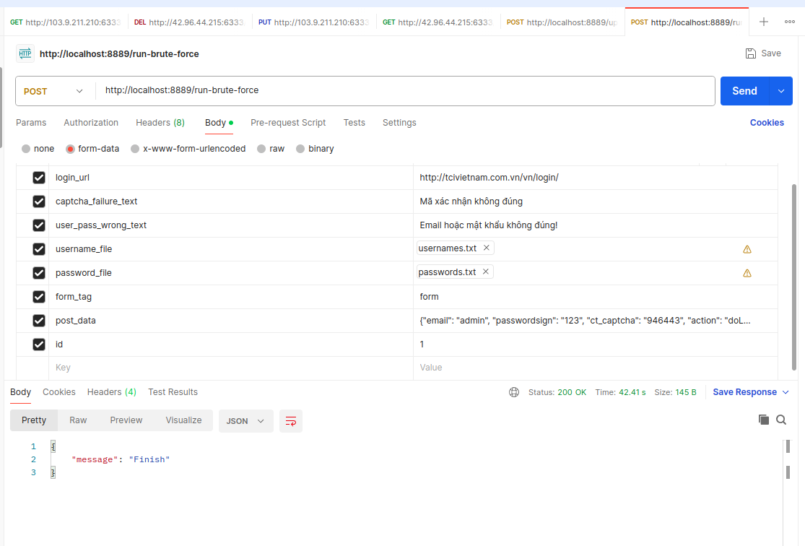

### Installation
1. docker build -t captcha .
2. docker run --network=host -it -v $(pwd):/home -w /home --name captcha_con captcha:latest bash

### How to run
```
python captcha_app.py
```

### API call


### Project structure
1. database --> models --> services --> api --> captcha_app.py
2. In models: database --> orm_models (use peewee for orm) --> other models (use pydantic for interact with data)

### ORM from existing database
python -m pwiz -e sqlite databasename > blog_models.py

### Sync vs Async
all function that call orm_models should define without async